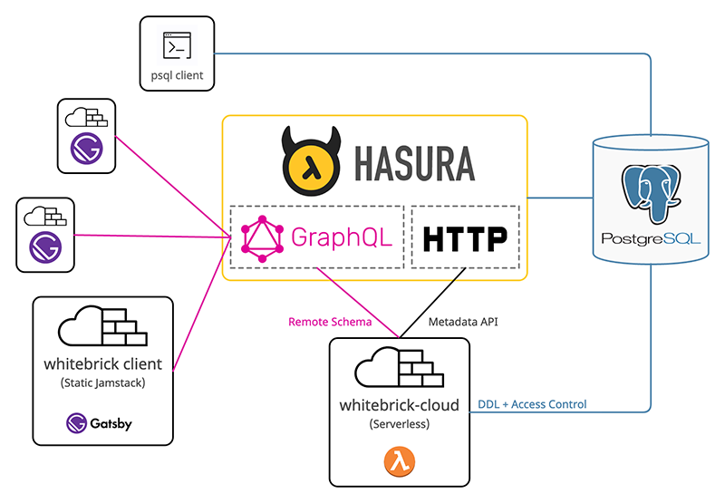
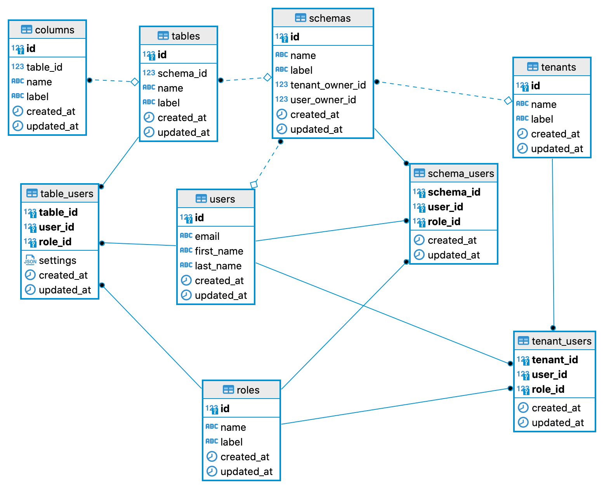

# whitebrick-cloud (backend)
### Open source Airtable alternative (No Code DB)
- whitebrick jamstack client on [GitHub](https://github.com/whitebrick/whitebrick)
- Hosted service at [whitebrick.com](https://whitebrick.com)

whitebrick-cloud is a serverless application that adds multi-tenant DDL and access control functions to [Hasura](https://github.com/hasura/graphql-engine).
Jamstack clients interface with whitebrick-cloud through a remote schema stitched to the Hasura GraphQL API. The default Hasura client provides DDL functions out-of-the-box
but achieves this by sending raw SQL to a schema endpoint which is not practical for multi-tenanted applications with varied access control.

whitebrick-cloud uses the following technologies
- [TypeScipt](https://github.com/microsoft/TypeScript) for typed JavaScript
- [Apollo Server](https://github.com/apollographql/apollo-server) for GraphQL
- [Axios](https://github.com/axios/axios) for HTTP
- [node-postgres](https://node-postgres.com/) for DAL
- [Serverless](https://github.com/serverless/serverless) for dev and deployment
- [webpack](https://github.com/webpack/webpack) for bundling
- [Karate](https://github.com/intuit/karate) for functional testing

---

## Getting Started

1. #### Configure Postgres
    Create a new database in PostgreSQL and ensure `pgcrypto` is in the search path (see [Hasura requirements](https://hasura.io/docs/latest/graphql/core/deployment/postgres-requirements.html))

2. #### Run Hasura
    Add the database credentials and run Hasura from [Docker](https://hasura.io/docs/latest/graphql/core/deployment/deployment-guides/docker.html#deployment-docker)
or [Kubernetes](https://hasura.io/docs/latest/graphql/core/deployment/deployment-guides/kubernetes.html#deploy-kubernetes) and be sure to set a `HASURA_GRAPHQL_ADMIN_SECRET`.
Launching Hasura will create data definitions and values in the `hdb_catalog` schema of the database. 

3. #### Install Hasura CLI
    [Install](https://hasura.io/docs/latest/graphql/core/hasura-cli/install-hasura-cli.html#install-hasura-cli) the Hasura CLI but do not init new config

4. #### Configure .env File
    Copy `./dot_env_example.txt` to `./.env.development` and complete with database connection parameters from (1) above.

5. #### Create wb Schema
    Change to the `./hasura` directory, copy `config-example.yaml` to `config.yaml` and complete with `admin_secret` from (2) above.
    This config is used for the Hasura CLI.
    Now create the whitebrick-cloud schema "`wb`" by running `bash ./_apply_latest_migration.bash`.
    After the migration is complete, change to the `./db` directory and run `bash ./_seed.bash` to insert the initial data.

6. #### Run Serverless Listener
    Run `bash ./_offline_start.bash` to start the serverless listener in local/offline mode

7. #### Add Remote Schema
    From The Hasura console, use the top menu to navigate to the "Remote Schemas" page, click add and enter the endpoint displayed from (6) above.
    **NB: If you are running Hasura in a local container you will need to use the corresponding URL** eg `http://host.docker.internal:3000/graphql`.
    If you now navigate to the "API" page from the top menu, In the query "Explorer" you should now see queries beginning with `wb*`. 

8. #### Run Functional Tests
    Download [Karate](https://github.com/intuit/karate#getting-started) (the [stand-alone executable](https://github.com/intuit/karate/wiki/ZIP-Release) is all that is needed).
    Update `./test/functional/karate-config.js` with your Hasura endpoint URL from (2) and then with Hasura running, change to the `./test` directory and run the command `karate functional/run.feature`

## Architecture

- ### DAL 
    With the bulk of persistence performed through Hasura, this DAL class is used for supplemental system-wide data persistence (tenants, users, roles, etc) and DDL (creating and altering schemas, tables, columns etc). This implementation has been purposely chosen as a lightweight alternative to ORM.

- ### HasuraApi
    Hasura needs to know about any DDL changes - for example, when a new table is added it must be _tracked_. This class is used to call the [Hasura Metadat API](https://hasura.io/docs/latest/graphql/core/api-reference/metadata-api/index.html) over HTTP.

- ### WhitebrickCloud
    This is the top-level API that exports the Apollo Server GraphQL handler and calls the DAL and HasuraAPI.

## DB Schema

